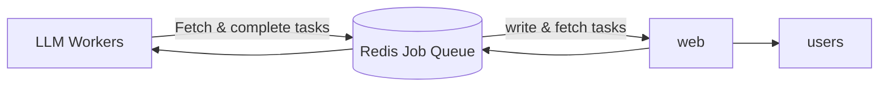

# llm_worker
load LLM and run as a worker

Design of LLM ChatBot
1. use producer & consumer paradigm, because the machines for LLM are costly
2. use Redis as job queue

```mermaid
flowchart LR
    A[LLM Workers] --Fetch & complete tasks--> B[(Redis Job Queue)]
    B-->A
    B --write & fetch tasks --> C[web]
    C --> B
    C --> D[users]
```
